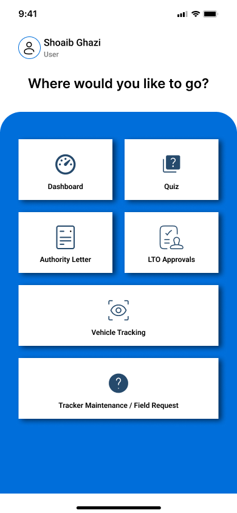
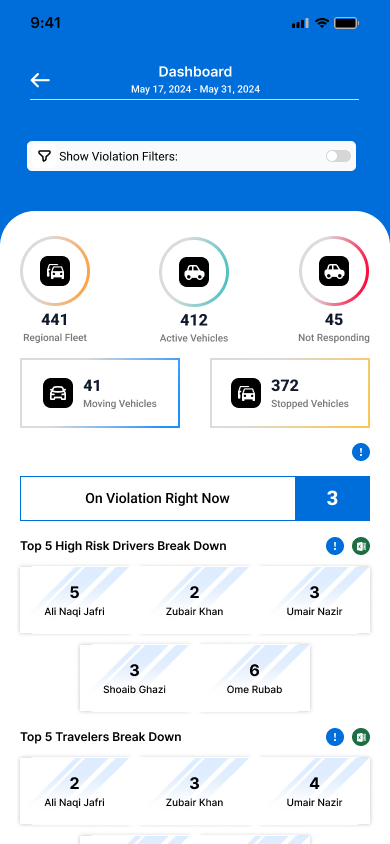
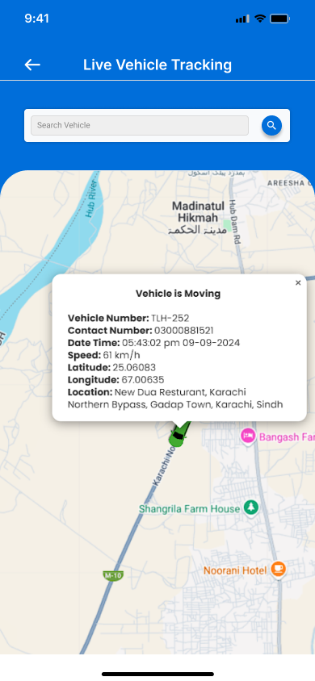
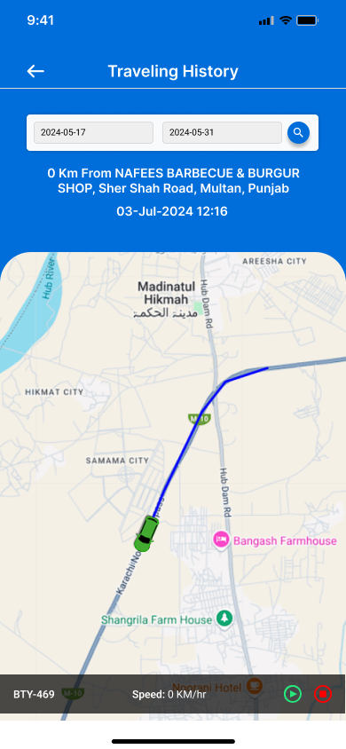
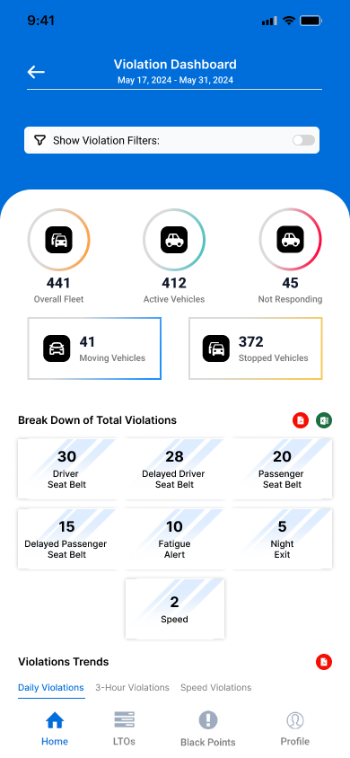
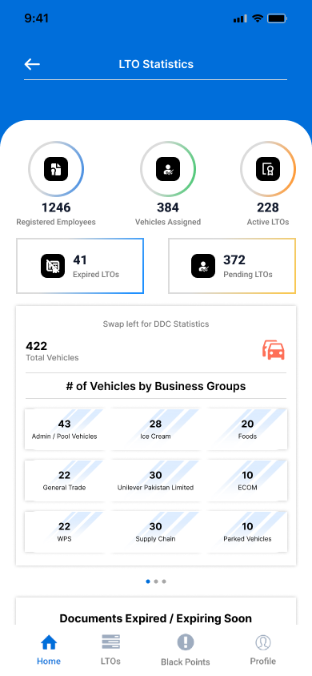
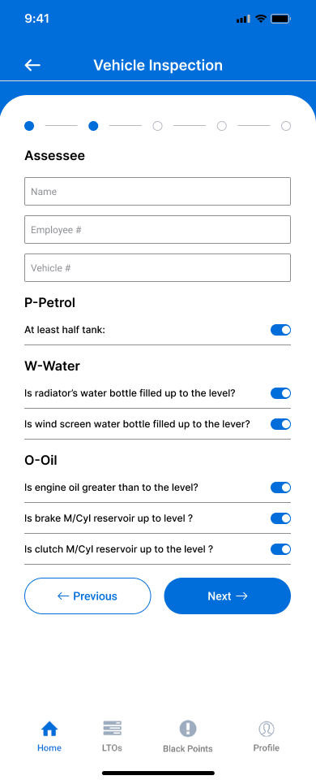
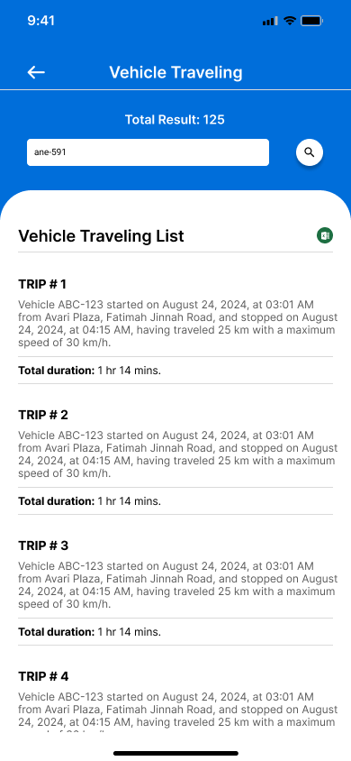
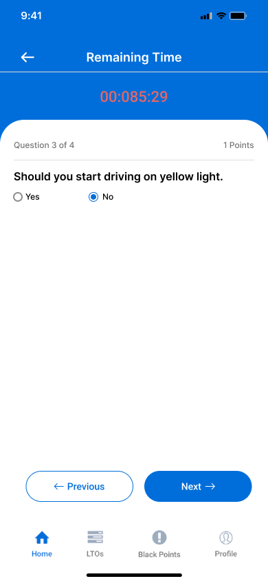

# Pasban — Fleet & Telematics Platform Case Study

A public proof-of-work case study for a React Native and Expo mobile application built for **fleet operations, GPS tracking, driver safety, vehicle compliance, reporting, training, and field-service workflows**.

This case study demonstrates how a mobile-first operational product can combine role-based workflows, fleet dashboards, map-based tracking, route playback, driver violations, LTO approvals, inspections, assessments, reports, quizzes, and reusable React Native UI architecture.

> This repository is a public case study. It does not expose private source code, API endpoints, authentication tokens, GPS coordinates, employee records, customer data, vehicle identifiers, production records, or confidential business information.

---

## Source Code & Review Scope

The full production codebase for this project is private and is not included in this public repository.

This repository contains a sanitized proof-of-work case study based on the local project implementation, verified feature review, architecture notes, public-safe screenshots, and selected safe code samples.

The purpose of this repository is to demonstrate mobile frontend architecture, React Native implementation, Redux-based state management, GPS/map UI, operational workflows, and product engineering approach without exposing private production code or sensitive fleet data.

---

## Project Overview

**Pasban** is a React Native and Expo mobile application for fleet operations, driver safety, vehicle compliance, training, and field-service workflows.

The application supports different user groups with role-specific access to:

* Fleet and vehicle-status dashboards
* Live vehicle tracking and historical route playback
* Driver violations and black-points analysis
* License to Operate, document, training, and approval workflows
* Vehicle inspections and road-driving assessments
* Tracker transfer, removal, checkup, and pre-information requests
* Operational reports for trips, mileage, late-night exits, vehicle status, inspections, and assessments
* Quiz, feedback, training-session, and user-profile management

The product consolidates operational data and field actions into a mobile interface instead of requiring users to work across separate tracking, reporting, compliance, and training systems.

---

## Case Study Highlights

| Area             | Proof                                                                                  |
| ---------------- | -------------------------------------------------------------------------------------- |
| Product Type     | Fleet operations, telematics, compliance, and safety mobile application                |
| Platform         | React Native and Expo mobile app                                                       |
| State Management | Redux, Redux Thunk, React Redux, async request/success/failure flows                   |
| Maps & GPS       | React Native Maps, marker clustering, live tracking, animated markers, route polylines |
| Operations       | Fleet status dashboards, reports, LTO approvals, inspections, tracker requests         |
| Driver Safety    | Speeding, seat-belt, fatigue, rest-time, night-exit, and black-points workflows        |
| Mobile UX        | Role-based menus, forms, cards, charts, modals, loading states, empty states           |
| Integrations     | REST APIs, Axios, AsyncStorage, notifications, image upload, file download/sharing     |

---

## Product Walkthrough

The screenshots below should use **synthetic or fully redacted data only**. Never publish real GPS coordinates, real driver names, vehicle IDs, license numbers, employee details, routes, phone numbers, or business locations.

### 1. Role-Based Mobile Experience

| Role Menu                                                                                      | Fleet Dashboard                                                                                                    |
| ---------------------------------------------------------------------------------------------- | ------------------------------------------------------------------------------------------------------------------ |
|  |  |

**What this shows:** Role-specific navigation for admin, GSM, and user workflows, plus operational fleet visibility through dashboard cards and summaries.

---

### 2. Live Tracking & Route Playback

| Live Tracking Map                                                                                            | Route Playback                                                                                                |
| ------------------------------------------------------------------------------------------------------------ | ------------------------------------------------------------------------------------------------------------- |
|  |  |

**What this shows:** Map-based fleet visibility, clustered markers, animated vehicle tracking, route polylines, and historical trip playback using safe synthetic data.

---

### 3. Driver Safety & Compliance

| Violations Dashboard                                                                                            | LTO Dashboard                                                                                                |
| --------------------------------------------------------------------------------------------------------------- | ------------------------------------------------------------------------------------------------------------ |
|  |  |

**What this shows:** Driver-risk monitoring, violation summaries, black-points workflows, and License to Operate compliance status.

---

### 4. Field Workflows & Reports

| Inspection Form                                                                                        | Reports Detail                                                                                         |
| ------------------------------------------------------------------------------------------------------ | ------------------------------------------------------------------------------------------------------ |
|  |  |

**What this shows:** Structured mobile forms for inspections and assessments, plus operational reporting for trips, mileage, late-night exits, and vehicle status.

---

### 5. Quiz & Training Workflow



**What this shows:** Mobile quiz/training session flow with question progress, timer, answer controls, validation, and submission state.

---

## Business Problem

Fleet and safety teams need to understand:

* Where vehicles are
* Whether vehicles are moving, stopped, responding, or non-responding
* Which drivers are creating safety risk
* Whether licenses, documents, and training are current
* Which inspections, assessments, and tracker requests need action
* How to review operational reports from mobile devices

Pasban addresses this by combining GPS-based tracking, driver-risk indicators, LTO workflows, structured mobile forms, role-based dashboards, reports, and training flows into a single mobile-first application.

Measured time savings, adoption, production fleet size, customer organization, safety impact, and operational KPIs are not claimed in this public case study.

---

## My Role

**Role:** Senior Frontend & Mobile Developer

My responsibilities included:

* Building React Native mobile screens for Android and iOS
* Implementing role-based navigation for admin, GSM, and standard user workflows
* Creating reusable UI components for cards, charts, forms, dropdowns, modals, progress indicators, loaders, and lists
* Integrating REST APIs using Axios
* Managing application state with Redux, Redux Thunk, and React Redux
* Implementing map-based UI with React Native Maps and marker clustering
* Supporting live tracking, route polylines, historical playback, vehicle states, and driver-risk views
* Building LTO, compliance, inspection, assessment, reports, quiz, and tracker request flows
* Handling AsyncStorage-based session data and role-based routing
* Supporting push-notification registration, image upload, document download, and file sharing workflows
* Improving mobile-first usability through loading, error, empty, success, and validation states

This case study does not claim sole ownership, backend ownership, team leadership, or production operations ownership.

---

## Tech Stack

| Area             | Technology                                                |
| ---------------- | --------------------------------------------------------- |
| Mobile Framework | React Native                                              |
| Runtime / Build  | Expo                                                      |
| Language         | JavaScript                                                |
| Navigation       | React Navigation                                          |
| State Management | Redux, Redux Thunk, React Redux                           |
| API Integration  | Axios, REST APIs                                          |
| Local Storage    | AsyncStorage                                              |
| Maps             | React Native Maps                                         |
| Map Clustering   | React Native Map Clustering                               |
| Charts           | React Native SVG, React Native SVG Charts                 |
| Notifications    | Expo Notifications                                        |
| Media / Files    | Expo Image Picker, Expo File System, Expo Sharing         |
| Feedback         | React Native Toast Message                                |
| Dates            | Moment.js                                                 |
| Styling          | React Native StyleSheet, Tailwind React Native Classnames |
| Typography       | Expo Google Fonts / Roboto                                |

---

## System Architecture

```text
fleet-telematics-platform-case-study/
├── README.md
├── screenshots/
│   ├── 01-role-menu-redacted.png
│   ├── 02-fleet-dashboard-synthetic.png
│   ├── 03-live-tracking-map-synthetic.png
│   ├── 04-route-playback-synthetic.png
│   ├── 05-violations-dashboard-synthetic.png
│   ├── 06-lto-dashboard-redacted.png
│   ├── 07-inspection-form-synthetic.png
│   ├── 08-report-detail-synthetic.png
│   └── 09-quiz-session-synthetic.png
├── architecture/
│   ├── system-overview.md
│   ├── navigation-flow.md
│   ├── state-management.md
│   └── data-flow.md
├── docs/
│   ├── verified-tech-stack.md
│   ├── feature-inventory.md
│   ├── screenshot-guide.md
│   └── security-and-redaction.md
└── code-samples/
    ├── reusable-chart/
    ├── animated-map-marker/
    ├── route-playback/
    ├── redux-async-flow/
    └── responsive-components/
```

The private implementation used a screen-oriented React Native architecture with shared components, Redux state, API utilities, stack-based navigation, role-specific menus, and mobile-first operational screens.

---

## Core Product Features

### Authentication & Role-Based Access

* Get-started and authentication flows
* Login, signup, forgot password, and new-password screens
* Session persistence
* Role-based post-login navigation
* Admin, GSM, and user menu experiences
* Logout and local-session cleanup

### Fleet Dashboards

* Fleet totals
* Responding and non-responding vehicles
* Moving and stopped vehicles
* Current violations
* Top high-risk drivers
* Top travelers by mileage
* License, training, DDC, and document status summaries

### Vehicle Tracking

* Entire-fleet map
* Clustered vehicle markers
* Vehicle search
* Live location refresh
* Animated vehicle movement
* Direction-based marker rotation
* Speed-based marker state
* Route polylines
* Historical travel playback

### Driver Safety

* Speed violations
* Seat-belt violations
* Fatigue alerts
* Rest-time violations
* Night-exit violations
* Black-points summaries
* Driver-specific detail workflows

### LTO & Compliance

* License to Operate dashboards
* Vehicle and driver compliance views
* Training and document status
* LTO initiation forms
* Approval workflows
* Authority-letter viewing
* Cancelled and active record states

### Inspections & Assessments

* Vehicle inspection forms
* Road-driving assessment forms
* Safety observations
* Findings and improvement fields
* Inspection and assessment reports

### Reports

* Vehicle last-update status
* Late-night exit reports
* Trip and travel reports
* Monthly mileage
* Vehicle inspection reports
* Road-driving assessment reports
* Filters, search, list, and detail screens

### Quiz & Training

* Active and past quiz sessions
* Timed question flow
* Single-answer, multiple-answer, yes/no, and text-answer handling
* Submission and result retrieval
* Admin quiz-session management

---

## State, API & Data Flow

The app uses Redux and Redux Thunk for async workflows.

General flow:

```text
User opens screen
        ↓
Screen dispatches Redux request action
        ↓
Axios service calls authenticated REST API
        ↓
Response is normalized or parsed
        ↓
Redux success/failure action updates state
        ↓
Screen renders loading, success, empty, or error UI
```

State domains include:

* Authentication
* Fleet
* LTO
* Users
* Reports
* Forms
* Tracking
* Quiz

AsyncStorage is used for authentication/session metadata and role-based startup decisions.

---

## Performance, Reliability & UX

The implementation includes:

* Memoized components and handlers in selected areas
* Marker clustering to reduce map overload
* `tracksViewChanges={false}` for selected map markers
* Animated marker and map movement
* FlatList incremental rendering for profile/user lists
* Throttled search behavior in selected reports
* Request, success, and failure state patterns
* Empty, loading, success, validation, and error states
* Cleanup for notification listeners and live-position polling intervals

---

## Privacy & Redaction

This repository must not include:

* API base addresses
* Authentication headers
* API keys
* Tokens
* Project identifiers
* Platform service configuration files
* Real GPS coordinates
* Route history
* Vehicle IDs
* Registration numbers
* Employee names
* Driver names
* License numbers
* Phone numbers
* Identity numbers
* Customer data
* Business groups or regions
* Production screenshots
* Production API responses

All screenshots, documentation, and code samples should be reviewed before publishing to make sure no private production data, credentials, employee information, vehicle information, location data, or confidential business details are exposed.

---

## Safe Public Code Samples

This public case study may include sanitized examples such as:

* Reusable bar chart component
* Loading indicator
* Progress circle and progress rectangle
* Stepper component
* Reusable modal
* Reusable checkbox
* Responsive device-size constants
* Animated map marker example
* Route playback controls
* Redux async action/reducer pair with generic endpoint names

The purpose of these samples is to demonstrate engineering approach, architecture, and mobile product thinking without exposing private production code.

---

## Business Value

This platform creates value by enabling:

* Mobile access to fleet and safety operations
* Centralized visibility for tracking, compliance, reports, and training
* Role-specific workflows for operational users
* Faster review of vehicle status and driver-risk signals
* Structured inspection, assessment, and tracker request flows
* Reusable React Native architecture for future operational modules

Measured production KPIs, fleet size, adoption, customer organization, and business impact are not claimed in this public case study.

---

## Suggested GitHub Repository Description

```text
Fleet and telematics mobile app case study built with React Native, Expo, Redux, REST APIs, GPS tracking, maps, route playback, driver safety, compliance workflows, reports, and mobile-first operational UI.
```

## Suggested GitHub Topics

```text
react-native
expo
fleet-management
telematics
gps-tracking
redux
mobile-app
driver-safety
maps
reports
operational-dashboard
case-study
proof-of-work
```

---

## Contact

**Muhammad Shiraz**
Senior Frontend & Mobile Developer
React.js | Next.js | TypeScript | React Native | Product UI | Frontend Architecture

* Email: [muhammadshiraz996@gmail.com](mailto:muhammadshiraz996@gmail.com)
* LinkedIn: [linkedin.com/in/muhammadshiraz](https://www.linkedin.com/in/muhammadshiraz)
* GitHub: [github.com/muhammadshiraz](https://github.com/muhammadshiraz)
* Portfolio: [muhammadshiraz.com](https://muhammadshiraz.com)

---

<div align="center">

### Built to demonstrate mobile frontend engineering, telematics UI, and operational product workflows.

</div>
